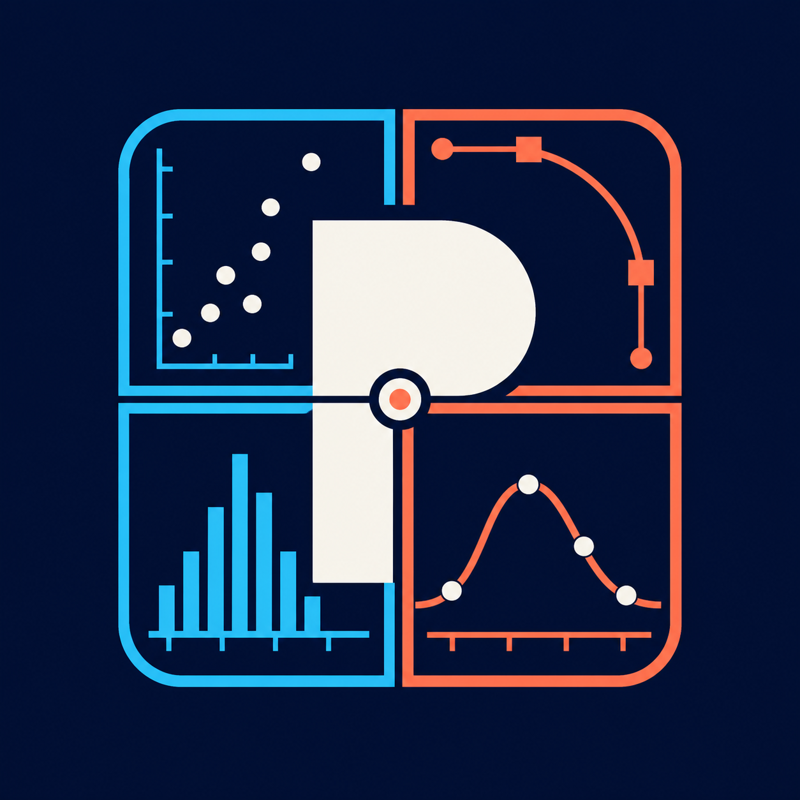
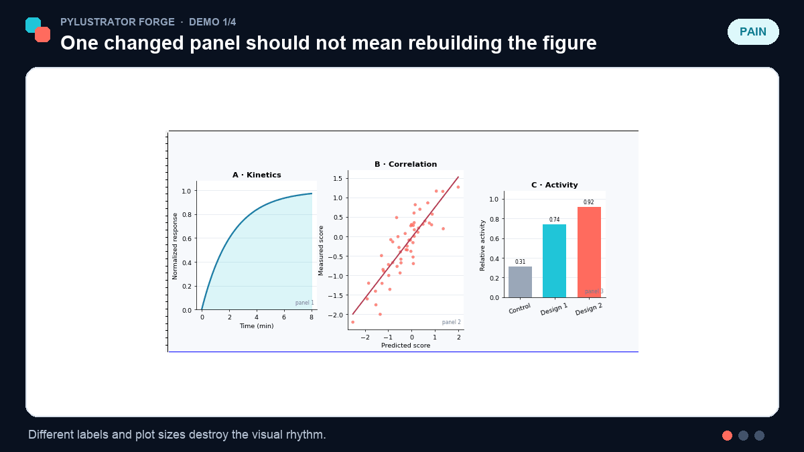
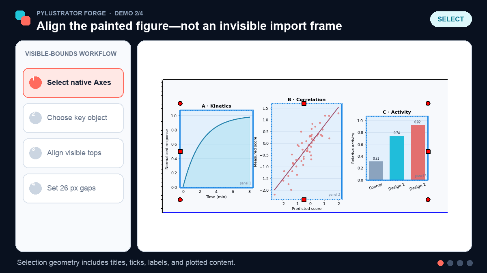
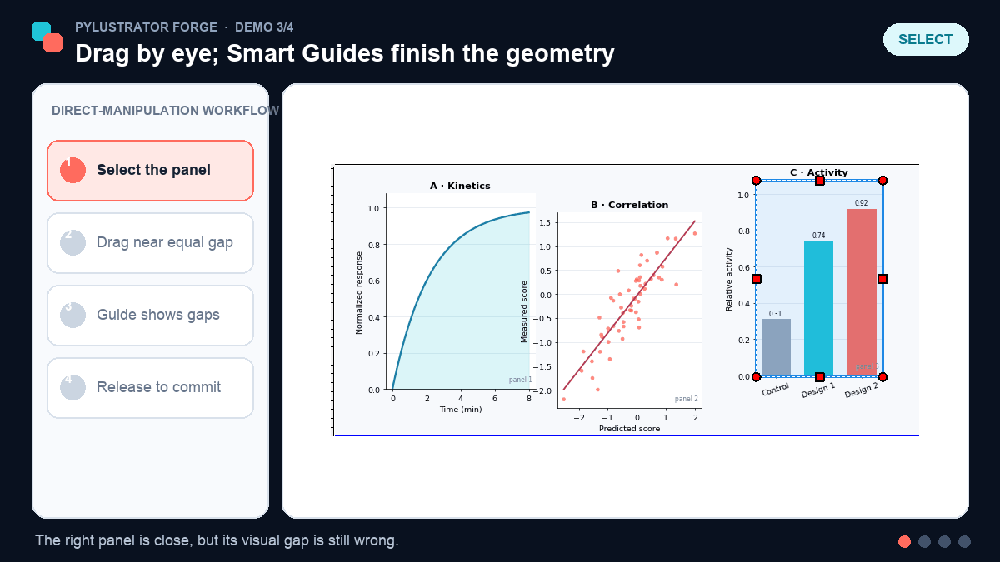
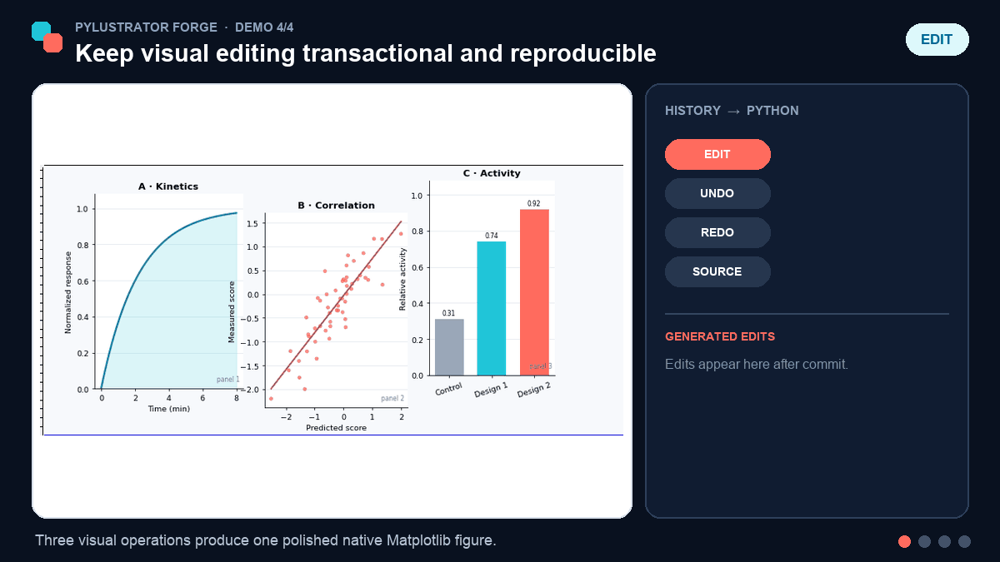

<p align="center">
  
</p>

<h1 align="center">Pylustrator Forge</h1>

<p align="center">
  <strong>Illustrator-like control. Matplotlib-native semantics. Reproducible Python.</strong>
</p>

<p align="center">
  <a href="https://github.com/Molaison/pylustrator-illustrator/actions/workflows/pytest.yml"></a>
  <a href="https://pylustrator.readthedocs.io"></a>
  <a href="LICENSE"></a>
  <a href="https://doi.org/10.21105/joss.01989"></a>
</p>

<p align="center">
  <a href="#quick-start">Quick start</a> ·
  <a href="#what-forge-adds">What changed</a> ·
  <a href="#see-it-in-action">Demos</a> ·
  <a href="#validation-snapshot">Validation</a> ·
  <a href="docs/artist_operation_support_matrix.md">Support matrix</a>
</p>

Build the plot in Python. Finish the figure by direct manipulation. Save the
result back to reproducible Python.

**Pylustrator Forge** is a deeply tested downstream fork of
[`rgerum/pylustrator`](https://github.com/rgerum/pylustrator) for researchers
who compose multi-panel publication figures and still want the precision of a
visual editor. It keeps Pylustrator's source-generating workflow, then rebuilds
the interaction layer around live Matplotlib objects, visible artwork, atomic
edits, and explicit capability checks.

> The user-facing brand is **Pylustrator Forge**. The package and import name
> remain `pylustrator` for compatibility.

## Why this exists

Adobe Illustrator is powerful for final figure assembly, but it creates a
fragile round trip. Change one source plot and you may need to export it again,
replace it, and repair the surrounding layout. Imported plots can also carry
clipping boxes, invisible frames, or container bounds that make “aligned”
objects look visually misaligned.

The original Pylustrator introduced a better premise: edit a live Matplotlib
figure and write the result back into the plotting script. In day-to-day use on
complex scientific figures, however, the original direct-manipulation model
still exposed many edge cases. Text, legends, lines, patches, collections, and
axes can look similar on screen while following different coordinate systems,
ownership rules, mutation APIs, and replay paths.

This fork grew out of a month of intensive dogfooding, edge-case testing, and
Codex-assisted refactoring. At the current comparison point it is **111 commits
ahead of upstream**, changing **79 files** with roughly **54k additions and 6k
deletions**. The goal is not to imitate every Illustrator operation. It is to
make the operations that can be represented in Matplotlib predictable,
reversible, and reproducible—and to reject the rest before they damage the
figure.

## What Forge adds

### Align what the reader sees

Selection boxes, drag previews, alignment, Smart Guides, and committed
positions share artist-aware display geometry. Where supported, that geometry
accounts for clipping, stroke width, markers, transformed paths, collection
offsets, and visible legend contents instead of trusting an invisible
container rectangle.

Align to:

- the current selection;
- the canvas/artboard; or
- an explicit key object.

Distribution and fixed-spacing operations use the same frozen geometry as
Undo/Redo.

### Select and transform predictably

- **Object Selection (`V`)** selects the logical object or group.
- **Direct Selection (`A`)** reaches the exact Matplotlib artist.
- Hover, click, Alt/Option click-through, candidate menus, and marquee
  selection share one ordered hit-resolution model.
- Containers stay out of ordinary marquee selection unless container mode is
  explicitly requested.
- Grouping, isolation, visibility, locking, and paint-order commands are editor
  concepts rather than accidental Matplotlib parent/child mutations.

Move, resize, native rotation, shared-pivot rotation, appearance scaling,
alignment, and property edits are separate operations. A mixed selection is
fully preflighted before the first artist changes.

### Get Illustrator-like feedback without flattening the figure

- Smart Guides snap edges, centers, baselines, anchors, cross-features, and
  equal gaps.
- Multi-object rotation uses one shared pivot; the pivot is draggable when
  every target supports exact rigid rotation.
- `A+` / `A−` scale supported fonts, strokes, and markers without pretending
  appearance is geometry.
- Cached content ghosts and an indexed hit path keep large figures responsive
  while the live Matplotlib artists remain untouched until commit.
- Bring Forward/Backward and Send to Front/Back follow actual stable paint
  order and update hit ordering atomically.

### Preserve semantic Matplotlib structures

- Legends retain logical ownership through selection, movement, frame changes,
  layout reflow, Undo/Redo, and source replay.
- Six core legend layout controls reflow the existing packing tree without
  replacing handles, labels, or title artists.
- Formatter-owned tick labels and axis labels edit through their semantic axis
  owner instead of accidentally moving the containing axes.
- `Line2D` movement and rotation preserve ndarray/MaskedArray dtype, shape,
  masks, fill values, categorical data, and datetime semantics.
- Editor windows can close and reopen without accumulating hidden Qt managers,
  timers, callbacks, or duplicate key handling.

### Make each gesture one transaction

One gesture creates one reversible history item. A cancelled or failed
operation restores artist geometry, generated-change bookkeeping, selection,
and scope. Semantic and floating-point no-ops are dropped.

Transform plans freeze an absolute destination and revalidate their source,
coordinate system, clip, layout, and group membership at commit. A stale plan
fails before mutation instead of committing a different result from the one
previewed.

## See it in action

Scientific figures rarely stay finished. Change one subplot and the familiar
assembly loop returns: export, replace, realign against imported frames, and
repeat. Forge keeps the figure live and makes the repair itself reproducible.

<table>
  <tr>
    <td width="50%" valign="top">
      <strong>1 · Pain → solution</strong><br>
      Repair a changed multi-panel figure without rebuilding the composition.
      <br><br>
      
    </td>
    <td width="50%" valign="top">
      <strong>2 · Align the painted figure</strong><br>
      Use visible bounds, a fixed key object, matched heights, and exact gaps.
      <br><br>
      
    </td>
  </tr>
  <tr>
    <td width="50%" valign="top">
      <strong>3 · Drag by eye, finish with geometry</strong><br>
      Smart Guides reveal and commit an equal visual gap during direct manipulation.
      <br><br>
      
    </td>
    <td width="50%" valign="top">
      <strong>4 · Keep the source of truth</strong><br>
      Undo and Redo are transactional; accepted edits remain reviewable Python.
      <br><br>
      
    </td>
  </tr>
</table>

The recordings above are generated by
[`docs/demo_forge_workflow.py`](docs/demo_forge_workflow.py) against the real
offscreen editor, alignment engine, Smart Guide session, history stack, and
change tracker.

## Workflow comparison

| Workflow | What you edit | After a source panel changes | Alignment basis |
|---|---|---|---|
| Illustrator after export | Detached vector/raster objects | Re-export, replace, and often repair layout | Imported object/frame bounds, depending on content |
| Upstream Pylustrator | Live Matplotlib figures plus generated source | Rerun the plotting script | Original Pylustrator interaction model |
| Pylustrator Forge | Live Matplotlib artists plus semantic commands | Rerun source and replay the generated block | Visible paint geometry where the operation is validated |

## Quick start

### Install this fork

This fork is not published under the upstream `pylustrator` distribution name.
`pip install pylustrator` installs the upstream project, not the interaction
architecture described here.

Install Forge directly from GitHub:

```bash
python -m pip install \
  "pylustrator @ git+https://github.com/Molaison/pylustrator-illustrator.git@main"
```

With `uv`:

```bash
uv pip install \
  "pylustrator @ git+https://github.com/Molaison/pylustrator-illustrator.git@main"
```

For a reproducible environment, replace `main` with a release tag or full
commit SHA.

### Edit an existing Matplotlib script

Call `pylustrator.start()` before creating the figure, then write ordinary
Matplotlib code:

```python
import matplotlib.pyplot as plt
import pylustrator

pylustrator.start()

fig, ax = plt.subplots()
ax.plot([0, 1, 2], [0, 1, 0], marker="o")
ax.set(xlabel="Time", ylabel="Response")

plt.show()
```

Edit the live figure, then press `Ctrl+S`. Pylustrator inserts or updates a
generated code block immediately before the `plt.show()` call, so rerunning the
script reproduces the edited figure.

### Compose multiple figure sources

`pylustrator.load()` can assemble trusted Python plot scripts, raster images,
and supported SVG content into one figure:

```python
import matplotlib.pyplot as plt
import pylustrator

pylustrator.load("panel_a.py")
pylustrator.load("panel_b.py", offset=[1, 0])

plt.show()
```

Python inputs are executed. Load only files you trust. See the upstream
[composition guide](https://pylustrator.readthedocs.io/en/latest/composing.html)
for offsets, physical units, caching, and supported formats.

### Core controls

| Action | Control |
|---|---|
| Object Selection | `V` |
| Direct Selection | `A` |
| Add/remove from selection | `Shift` + click |
| Cycle overlapping candidates | `Alt` / `Option` + click |
| Group / Ungroup | `Ctrl+G` / `Ctrl+Shift+G` |
| Undo / Redo | `Ctrl+Z` / `Ctrl+Y` or `Ctrl+Shift+Z` |
| Delete selection | `Delete` or `Backspace` |
| Save generated source | `Ctrl+S` |

## Correctness before approximation

Not every Matplotlib artist can safely support every operation. Forge treats
that as a contract, not an invitation to guess.

For example, layout-owned legend children, formatter-owned tick labels,
auto-positioned titles, and constrained-layout labels may remain selectable
and property-editable while deliberately rejecting independent transforms that
Matplotlib would overwrite on the next draw. A mixed selection is supported
only when the complete selection can perform the requested operation.

See:

- [artist operation support matrix](docs/artist_operation_support_matrix.md)
  for current per-type guarantees and deliberate limitations;
- [interaction roadmap](docs/illustrator_interaction_roadmap.md) for the
  implemented architecture and remaining productivity work;
- [extension API](docs/api.rst) for custom artist adapters and legend entry
  serializers.

## Validation snapshot

At the 2026-07-18 fork milestone:

- the full suite passed with **1,299 tests passed and 178 skipped**, with no
  strict xfails;
- Ruff and Ty completed successfully with an explicit baseline for dynamic
  Matplotlib/Qt modules;
- CI exercised Python 3.11 at every declared lower dependency bound, plus
  locked Python 3.12 and 3.13 environments; and
- a real multi-panel scientific figure was used to validate selection,
  movement, resize, rotation, alignment references, Smart Guides, legends,
  masked `Line2D` replay, axis-label editing, paint-order stacking, window
  close/reopen, save/replay, and Undo/Redo.

The tested runtime contract is:

| Python | Dependency set |
|---|---|
| 3.11 | Every declared direct dependency at its lower bound |
| 3.12 | Versions resolved by `uv.lock` |
| 3.13 | Versions resolved by `uv.lock` |

Python 3.9, Python 3.10, and Matplotlib 2.x are outside the supported matrix.
Other environments may work, but they are not part of the tested promise.

## Offline generated-source doctor

Historical generated blocks can fail before Pylustrator starts—for example,
when an old block contains bare `nan` or `inf`. Forge includes a read-only-by-
default doctor that inspects Python source without importing or executing it:

```bash
# Diagnose one file or recursively scan a directory.
pylustrator-source path/to/figure.py
pylustrator-source path/to/figures/

# Preview exact changes, then explicitly request an atomic write.
pylustrator-source --diff path/to/figure.py
pylustrator-source --write path/to/figure.py
```

It recognizes exact Pylustrator marker comments, preserves source encoding,
newlines, and file mode, and fails closed on malformed or future schemas. See
the [source doctor reference](docs/source_doctor.rst) for the full safety
contract.

## Architecture in one screen

- [`artist_adapters.py`](pylustrator/artist_adapters.py) defines visible
  geometry, hit testing, capabilities, snapshots, mutations, and replay at the
  artist boundary.
- [`interaction.py`](pylustrator/interaction.py) and
  [`interaction_index.py`](pylustrator/interaction_index.py) provide one
  selection and hit-resolution model.
- [`display_geometry.py`](pylustrator/display_geometry.py) shares revisioned
  geometry between selection, marquee, previews, alignment, and Smart Guides.
- [`transform_engine.py`](pylustrator/transform_engine.py),
  [`commands.py`](pylustrator/commands.py), and
  [`property_transactions.py`](pylustrator/property_transactions.py) enforce
  preflighted, atomic, replayable operations.

## Development

```bash
git clone https://github.com/Molaison/pylustrator-illustrator.git
cd pylustrator-illustrator
uv sync --locked --all-extras --dev
uv run pytest
uv run ruff check .
uv run ty check
```

Bug reports and feature proposals belong in the
[fork issue tracker](https://github.com/Molaison/pylustrator-illustrator/issues).
If a problem also reproduces in unmodified upstream Pylustrator, please consider
reporting it to the
[upstream issue tracker](https://github.com/rgerum/pylustrator/issues) as well.

## Upstream, citation, and license

Pylustrator Forge exists because Richard Gerum and the upstream contributors
built the original Pylustrator project and its reproducible source-generation
workflow. Read the [upstream documentation](https://pylustrator.readthedocs.io)
and cite the [original JOSS paper](https://doi.org/10.21105/joss.01989) when
Pylustrator contributes to published work.

This downstream fork remains licensed under the
[GNU General Public License v3.0 or later](LICENSE). The Forge name and fork-
specific changes do not imply endorsement by the upstream maintainers.
